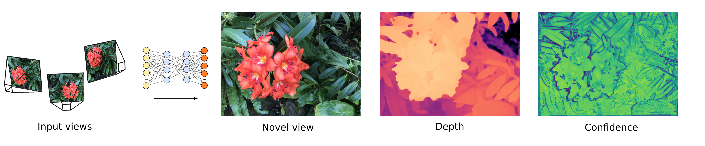

# NeuralMVS 


<!-- ### [Project Page](https://www.ais.uni-bonn.de/videos/RSS_2020_Rosu/) | [Video](https://www.youtube.com/watch?v=503Z5Vw9a90) | [Paper](https://www.ais.uni-bonn.de/videos/RSS_2020_Rosu/RSS_2020_Rosu.pdf) -->

[NeuralMVS: Bridging Multi-View Stereo and Novel View Synthesis](https://arxiv.org/abs/2108.03880)  
 [Radu Alexandru Rosu](https://www.ais.uni-bonn.de/%7Erosu/) <sup>1</sup>,
 [Sven Behnke](https://www.ais.uni-bonn.de/behnke/) <sup>1</sup>
 <br>
 <sup>1</sup>University of Bonn, Autonomous Intelligent Systems
   

<p align="middle">
  
</p>

This is the official PyTorch implementation of [NeuralMVS: Bridging Multi-View Stereo and Novel View Synthesis](https://arxiv.org/abs/2108.03880) 

NeuralMVS can process RGB images of a scene in order to perform novel view rendering and additionally learns the 3D structure of the scene in an unsupervized way. It can render novel high resolution images in real-time together with the depth of the scene and a confidence map. The implementation is written in PyTorch.

# Getting started 


### Dependencies 

For NeuralMVS we use [DataLoaders] for loading the data and interface it using [EasyPBR]. The dependencies of these two packages and also NeuralMVS can be installed with:

```sh
$ sudo apt-get install python3-dev python3-pip python3-setuptools 
$ sudo apt-get install libglfw3-dev libboost-dev libeigen3-dev libopencv-dev
```


### Install

The easiest way is to sequentially install each required package using the following:

```sh
$ git clone --recursive https://github.com/RaduAlexandru/easy_pbr
$ cd easy_pbr && make && cd ..
$ git clone --recursive https://github.com/RaduAlexandru/data_loaders  
$ cd data_loaders && make && cd ..
$ git clone --recursive https://github.com/RaduAlexandru/neural_mvs
$ cd neural_mvs && make && cd ..
```

### Data 

NeuralMVS uses RGB images together with camera pose for training. The data is loaded with the [DataLoaders] package and interfaced using [EasyPBR]. Here we show how to train on the [DTU], [LLFF] and [NeRF] synthetic dataset.<br/>
Download either dataset by clicking on their respective links.

Next modify the `neural_mvs/config/train.cfg` and for each respective loader modify the `dataset_path` to the folder in which your dataset is located.


# Usage

### Train 

NeuralMVS uses config files to configure the dataset used, the training parameters, model architecture and various visualization options.<br/>
The config file used to train can be found under "neural_mvs/config/train.cfg".<br/>
Running the training script will by default read this config file and start the training.


```sh
$ cd neural_mvs
$ ./neural_mvs_py/train.py
```

By default the data is visualized using tensorboard. Therefore we recommend to run the following lines before starting the training script.

```sh
$ cd neural_mvs
$ mkdir tensorboard_logs
$ tensorboard --logdir=tensorboard_logs --port=6006
```

The training can be visualized in the browser under `http://localhost:6006/`


### Configuration options 

Various configuration options can be interesting to check out and modify. We take neural_mvs/config/train.cfg as an example. 

```
core: hdpi: false          #can be turned on an off to accomodate high DPI displays. If the text and fonts in the visualizer are too big, set this option to false
train: with_viewer: false  #setting to true will start a visualizer which displays the currently predicted 3D point cloud and image. May not be usable when running on a headless server
``` 

## Citation

```
@inproceedings{rosu2021neuralmvs,
  title={NeuralMVS: Bridging Multi-View Stereo and Novel View Synthesis},
  author={Rosu, Radu Alexandru and Behnke, Sven},
  booktitle="International Joint Conference on Neural Networks (IJCNN)",
  year={2021}
}

```


   [EasyPBR]: <https://github.com/RaduAlexandru/easy_pbr>
   [DataLoaders]: <https://github.com/RaduAlexandru/data_loaders>
   [DTU]: <https://drive.google.com/drive/folders/1PsT3uKwqHHD2bEEHkIXB99AlIjtmrEiR>
   [LLFF]: <https://drive.google.com/uc?id=16VnMcF1KJYxN9QId6TClMsZRahHNMW5g>
   [NeRF]: <https://drive.google.com/uc?id=18JxhpWD-4ZmuFKLzKlAw-w5PpzZxXOcG>


# License
NeuralMVS is provided under the terms of the MIT license (see LICENSE) 